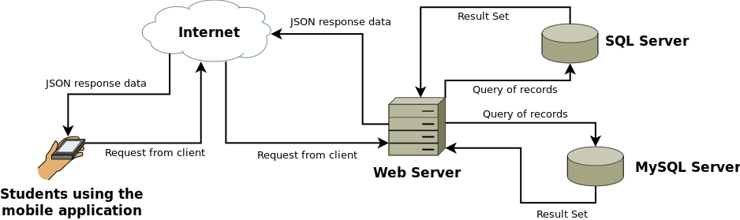

# mobilecmu-api
This Backend API serves the data that is consumed by mobileCMU. It connects to the
existing DBs of the Student Information System at Central Mindanao University. This
backend API is built using [Laravel v5](https://laravel.com/docs/5.2), a PHP framework
for creating awesome web applications.

This app is an output of the Capstone Project entitled:

**CENTRAL MINDANAO UNIVERSITY STUDENT PORTAL MOBILE APPLICATION USING HYBRID APPROACH**

## Setup
1. Clone this repository.
2. Install PHP v5.6 or higher, Composer.
3. Run `composer install` command to install dependencies.
4. Create a copy of `.env.example` and name it to `.env`
5. Configure settings on `.env` file (e.g. DB Connection and App environment).

## Requirements
### Software
* PHP 5.6 or higher
* Composer
* Web Server (IIS, Apache, Nginx, or PHP Dev Server)
* Database supported by Laravel v5.2

## Mobile App
This Backend API serves data consumed by mobileCMU.
The code for this Mobile App is found at the repository
[@harriebird/mobilecmu-mobile](https://github.com/harriebird/mobilecmu-mobile).

## License
Code released under the [MIT License](LICENSE)
